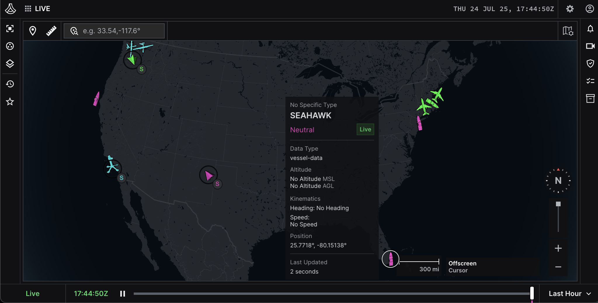

# AIS to Lattice Integration

This is a sample application showcasing a REST integration in Python that transmits simulated AIS vessel traffic data to Lattice.
The sample application demonstrates how to create an entity as a JSON payload and call the `Lattice.entities.publish_entity` method to publish an entity to Lattice.



The AIS (Automatic Identification System) vessel traffic dataset is a repository of vessel identification and positioning data. The data is collected through an onboard navigation safety device that transmits and monitors the location and characteristics of vessels in U.S. For this sample demonstration, the only 4 fields in the dataset that we are interested in are the MMSI, latitude, longitude, and vessel name. These fields are used to simulate maritime traffic, creating and continuously updating vessel entities with their latest position and publishing them to the Lattice API in real-time.


## Before you begin

- Install Python version greater than or equal to 3.9.
- Complete the [set up](https://developer.anduril.com/guides/getting-started/set-up) instructions in the *Lattice SDK Documentation*.

## Clone the repository

```bash
git clone https://github.com/anduril/sample-app-ais-integration-rest.git sample-app-ais-integration-rest
cd sample-app-ais-integration-rest
```

> Optional: Initialize a virtual environment
> ```bash
> python -m venv .venv
> source .venv/bin/activate
> ```

## Install dependencies and configure project

1. Install the dependencies used for this project:
    ```bash
    pip install -r requirements.txt
    ```
1. Modify the configuration file in `var/config.yml`:
    * Replace `<ENVIRONMENT_TOKEN>` and `<LATTICE_ENDPOINT>` with your environment endpoint and tokens:
    * You can also modify:
        - `entity-update-rate-seconds`: To change the interval between publishing vessel entities
        - `vessel-mmsi`: To change the vessels to track
        - `ais-generate-interval-seconds`: To change the interval between generating vessel data

## Run the app

Run the following command to start the app
```bash
python src/main.py --config var/config.yml
```

## Verify the output

Navigate to your Lattice UI and verify that the vessel entities are displayed.

